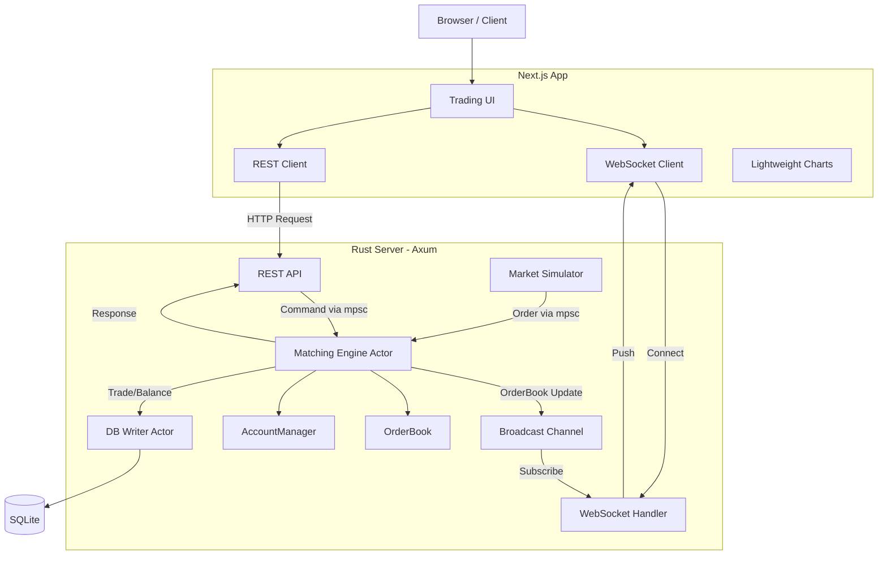

# badbit

**badbit** は、学習目的で構築された仮想通貨取引所システムのシミュレーターです。
高性能なマッチングエンジン、リアルタイムのオーダーブック配信、モダンなフロントエンドUIを一通り実装しており、取引システムのアーキテクチャや並行処理（Actorモデル）の学習用リソースとして設計されています。

> **Note**: 本プロジェクトは商用利用を目的としたものではなく、あくまで学習・実験用のサンドボックスです。

## 特徴

- **高速マッチングエンジン**: Rust + Tokio による非同期Actorモデルを採用し、ロック競合を最小限に抑えた設計。
- **リアルタイム更新**: WebSocket を通じてオーダーブック（板情報）をリアルタイムに配信（20fps制限で最適化済み）。
- **市場シミュレーター**: 自動的に注文を生成するボットが内蔵されており、常に動的な板の動きを観察可能。
- **永続化**: SQLite を使用してユーザー残高や取引履歴を非同期に保存。
- **モダンなUI**: Next.js 16 + Tailwind CSS v4 を採用したダークテーマのトレーディング画面。
- **フル機能の注文管理**: 指値注文の発注・キャンセル、リアルタイムな残高更新とポジション管理が可能。

## アーキテクチャ

システムは大きく分けて、Rustによるバックエンド（マッチングエンジン）とNext.jsによるフロントエンドで構成されています。



## 技術スタック

### Backend (Rust)

- **Core**: `Rust (2024 edition)`, `Tokio` (Async Runtime)
- **Web Framework**: `Axum`
- **Database**: `SQLx` + `SQLite`
- **Data Types**: `Rust Decimal` (高精度な数値計算), `Uuid`
- **Architecture**: Actor Model (using `tokio::sync::mpsc`, `broadcast`)

### Frontend (TypeScript)

- **Framework**: `Next.js 16` (App Router), `React 19`
- **Styling**: `Tailwind CSS v4`, `Lucide React`
- **Charts**: `Lightweight Charts` (TradingView)
- **Components**: `Radix UI` primitives

## 始め方

### 前提条件

- Rust (latest stable)
- Node.js (v20+) & npm

### バックエンドの起動

プロフェクトのルートディレクトリで以下を実行します。これにより、APIサーバーとマッチングエンジン、シミュレーターが起動します。

```bash
cd backend
cargo run
# サーバーは http://localhost:8000 で起動します
```

### フロントエンドの起動

別のターミナルを開き、`frontend` ディレクトリで以下を実行します。

```bash
cd frontend
npm install  # 初回のみ
npm run dev
# ブラウザで http://localhost:3000 を開いてください
```

## ディレクトリ構造

- `backend/`: Rustバックエンド
  - `src/`: ソースコード
    - `main.rs`: エントリーポイント、サーバー設定
    - `engine.rs`: マッチングエンジン（Actor）
    - `orderbook.rs`: 板情報の管理ロジック
    - `account.rs`: 口座残高の管理
    - `simulator.rs`: 市場シミュレーター
- `frontend/`: Next.jsフロントエンドアプリケーション

## ライセンス & 免責事項

本ソフトウェアは学習目的で提供されています。実際の金融取引システムとしての利用を想定したセキュリティ監査や堅牢性テストは行われていません。
